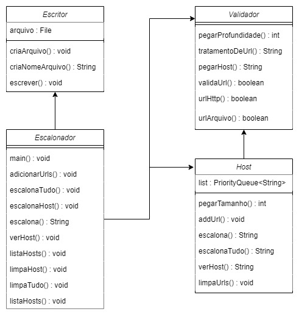

# Escalonador de URLs

## Grupo

- [Fábio Augusto Araújo Santos](https://github.com/fabio-aug)
- [Luana Assis Silva](https://github.com/luanaassis)

## Introdução

Desenvolvimento de um escalonador de URLs, adotando a estratégia `depth-first` priorizando conjuntos de hosts das URLs encontradas primeiro e ordenando por profundidade. Para isso foi usado um `LinkedHashMap<String, Host>` para armazenamento e ordenação por ordem de inserção dos Hosts e em cada Host foi criado uma `PriorityQueue<String>` para armazenamento e organização por profundidade e ordem de inserção das URLs.

## Estrutura

O ambiente de trabalho utilizado foi o Visual Studio Code. Os arquivos foram organizados da seguinte forma:

- `/src`: pasta destinada aos códigos fontes do projeto.
- `/.vscode`: pasta destinada a configuração do projeto caso use a extensão [Extension Pack for Java](https://marketplace.visualstudio.com/items?itemName=vscjava.vscode-java-pack).
- `/images`: pasta destinada as imagens do projeto.

Obs: para rodar usando a extensão é necessário algumas alterações no código.

## Classses e Métodos

<div style="display:flex; justify-content:center; flex-direction:column">
  <strong>Diagrama de classes:</strong>
  </br>
  
</div>

</br>

- **Escritor:** Esta classe é responsável pela criação do arquivo de saída, e da manipulação do mesmo, a fim de adicionar todas os retornos aos comandos inseridos no arquivo de entrada.
  - **criaArquivo:** Este método valida se é possível criar um novo arquivo com o nome padrão, e caso o arquivo já exista, ele retira as informações que já existiam no mesmo.
  - **criaNomeArquivo:** Este método cria e retorna, a partir de uma manipulação do nome do arquivo de entrada, o nome do novo arquivo de saída, seguindo o padrão "<nome_do_arquivo_de_entrada>-out.txt".
  - **escrever:** Este método é responsável por acrescentar e inserir o retorno das funções ao arquivo de saída.

</br>

- **Validador:** É a classe responsável por realizar as validações e manipulações das URL's inseridas.
  - **pegarProfundidade:** Este método realiza a remoção do protocolo HTTP, e a separação no símbolo "/" para que, após esta manipulação, retorne a "profundidade" da URL.
  - **tratamentoDeUrl:** Este método remove o "www." da URL usando o método replace, desconsidera os fragmentos da URL e a "/" barra do final da URL, caso exista.
  - **pegarHost:** Este método tem o objetivo de obter o host da URL informada. A partir da URL principal, são realizados dois splits inicialmente no "://" para desconsiderar o protocolo, e após no "/" para pegar a primeira posição que contém o host. Após isso, desconsideramos o "www.".
  - **validaUrl:** Este método tem o objetivo de validar, a partir dos resultados obtidos dos métodos urlHttp e urlArquivo, se a URL informada atende às regras estabelecidas. Ou seja, se o protocolo é HTTP, se não retorna falso, e se o tipo de arquivo é permitido, se não retorna falso.
  - **urlHttp:** Este método valida se o protocolo da URL é HTTP. Esta validação ocorre com um split nos caracteres "://", e com uma comparação da primeira posição com o protocolo válido. Retorna verdadeiro se o protocolo for válido, e falso caso contrário.
  - **urlArquivo:** Este método valida se a URL possui algum tipo de arquivo que não é referente à uma página HTML. A validação ocorre através de uma comparação da URL com os tipos de arquivos proibidos contidos em um vetor de Strings. Caso contenha algum dos arquivos proibidos, retorna verdadeiro, caso contrário retorna falso.

</br>

- **Host:** Esta classe tem como objetivo organizar e manipular os Hosts e as suas respectivas URL's.
  - **pegarTamanho:** Este método tem como objetivo retornar a quantidade de URL's do mesmo Host.
  - **addUrl:** Este método tem como objetivo adicionar uma nova URL na lista do seu Host caso a URL ainda não exista na memória.
  - **escalona:** Este método tem como objetivo escalonar uma quantidade determinada pelo usuário de URL's de um mesmo Host. Além disso, ele retira da lista e retorna as URL's escalonadas.
  - **escalonaTudo:** Este método tem como objetivo escalonar todas as URL's de um mesmo Host. Além disso, as URL's são retiradas da lista e retornadas.
  - **verHost:** Este método tem como responsabilidade retornar todas as URL's do Host de forma priorizada. Este método utiliza da manipulação de uma cópia da lista original.
  - **limpaUrls:** Este método tem como responsabilidade limpar, ou seja, remover todas as URL's do Host. A função é executada através do método clear() da ```PriorityQueue<String>```.

</br>

- **Escalonador:**
  - **main:**
  - **adicionarUrls:**
  - **escalonaTudo:**
  - **escalonaHost:**
  - **escalona:**
  - **verHost:**
  - **listaHosts:**
  - **limpaHost:**
  - **limpaTudo:**
  - **listaHosts:**

## Análise de Complexidade

## Conclusão: frase do que foi feito e dizer o que foi aprendido

Com a implementação desta solução, aprendemos sobre novos tipos de estrutura que a linguagem Java nos proporciona como Linked List e LinkedHashMap, e como podemos manipulálas para nos auxiliar em novas aplicações.

## Apêndice Instruções para compilação e execução

- Para compilar o projeto, basta inserir a seguinte linha de comando no terminal dentro da pasta ```src``` : ```javac .\Escalonador.java```.

- Para executar o projeto, é necessário inicialmente um arquivo de texto (.txt) com os comandos e informações que devem ser executados pelo projeto. Este arquivo deve ser incluído na pasta ```src```. Após isso, basta inserir a seguinte linha de comando, também dentro da pasta ```src```, no terminal para realizar a execução: ```java .\Escalonador.java <nomeArquivo>.txt```.
